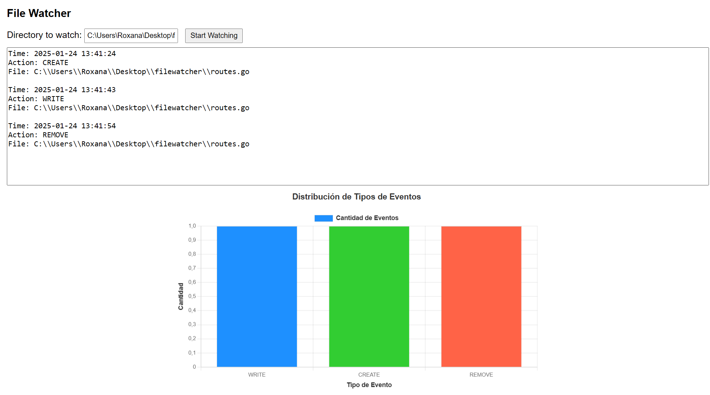
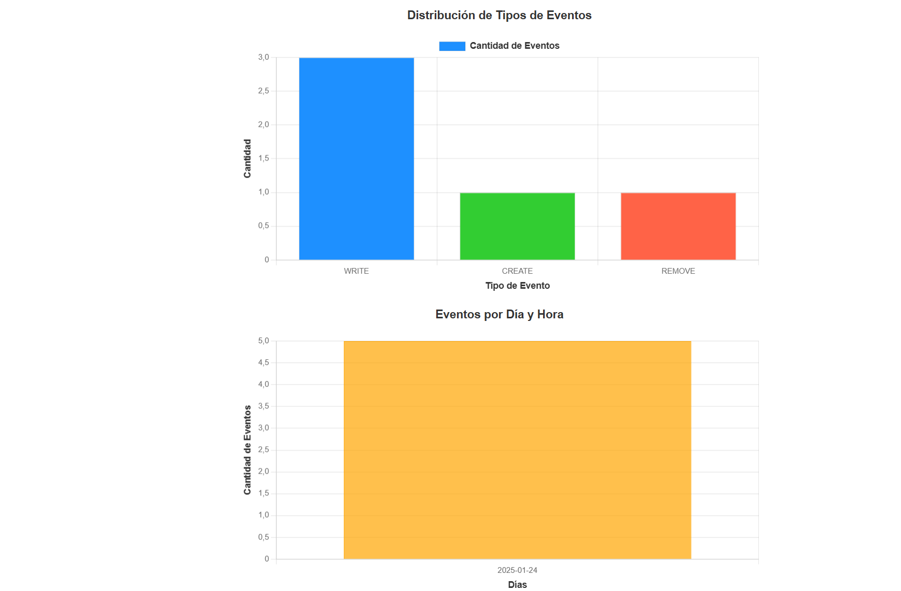

## File Watcher

File Watcher es una aplicación desarrollada en  Go (Golang)  con el framework Fiber, que permite monitorear en tiempo real los cambios en un directorio y sus subdirectorios. Los eventos detectados, como creación, modificación y eliminación de archivos, se registran en una base de datos PostgreSQL y se muestran con una interfaz gráfica accesible desde el navegador.

## Imágenes de la Aplicación

### Gráfica de Eventos por Tipo

### Historial de Eventos por Dias

## 🛠 Tecnologías Utilizadas
Go (Golang): Lenguaje principal de desarrollo.
Fiber: Framework para manejar el servidor HTTP.
fsnotify: Biblioteca para monitorear eventos del sistema de archivos.
PostgreSQL: Base de datos para almacenar los eventos detectados.
HTML, CSS y JavaScript: Para la interfaz de usuario.
EventSource (SSE): Para la transmisión de eventos en tiempo real al navegador.
## ✨ Características
Monitoreo en Tiempo Real:

Detecta eventos en el directorio seleccionado y en todos sus subdirectorios.
Tipos de eventos soportados:
Creación (CREATE).
Modificación (WRITE).
Eliminación (REMOVE).
Detalles registrados:
Hora del evento.
Tipo de acción.
Archivo o directorio afectado.
Última fecha de modificación.
Base de Datos PostgreSQL:

Todos los eventos se almacenan en una tabla dedicada.
Campos almacenados:
Tipo de evento.
Nombre del archivo o directorio.
Ruta completa.
Fecha de última modificación.
Hora del evento.
Interfaz Gráfica:

Responsiva y accesible desde cualquier navegador.
Gráficas que muestran:
Distribución de eventos por tipo.
Historial de eventos por día.
Colores diferenciados para cada tipo de evento:
Verde: Creación.
Azul: Modificación.
Rojo: Eliminación.
Multicliente:

Permite que varios dispositivos conectados al servidor visualicen los eventos en tiempo real.
Compatibilidad Multiplataforma:

Funciona en sistemas Windows, macOS y Linux.
📋 Requisitos
Go: Versión 1.20 o superior.
PostgreSQL: Instalado y configurado.
Archivo .env con las credenciales de la base de datos.
Navegador moderno (Chrome, Firefox, Edge, etc.).
🚀 Instalación y Configuración
1. Clonar el Repositorio
bash
Copiar
Editar
git clone https://github.com/tu-usuario/filewatcher.git
cd file-watcher
2. Configurar el Archivo .env
Crea un archivo llamado .env en el directorio raíz y define las credenciales de tu base de datos PostgreSQL:

env
Copiar
Editar
DB_HOST=localhost
DB_PORT=5432
DB_USER=postgres
DB_PASSWORD=tucontraseña
DB_NAME=filewatcher_db
3. Crear la Base de Datos
Ejecuta el siguiente comando SQL en tu base de datos PostgreSQL para crear la tabla requerida:

sql
Copiar
Editar
CREATE TABLE directory_events (
    id SERIAL PRIMARY KEY,
    event_type VARCHAR(50) NOT NULL,
    file_name TEXT NOT NULL,
    file_path TEXT NOT NULL,
    last_modified TIMESTAMP,
    event_time TIMESTAMP DEFAULT NOW()
);
4. Instalar Dependencias
Ejecuta el siguiente comando para instalar las dependencias necesarias:

bash
Copiar
Editar
go get ./...
5. Estructura de Archivos
Tu proyecto debe seguir esta estructura:

arduino
Copiar
Editar
file-watcher/
├── static/
│   ├── css/
│   │   └── style.css
│   ├── js/
│   │   └── script.js
│   └── index.html
├── main.go
├── .env
└── README.md
6. Ejecutar la Aplicación
Inicia el servidor ejecutando:

bash
Copiar
Editar
go run main.go
7. Abrir en el Navegador
Accede a la aplicación en http://localhost:3000.

📊 Visualización de Datos
1. Tabla de Eventos
Usa herramientas como pgAdmin o el cliente de línea de comandos de PostgreSQL para consultar la tabla directory_events y ver los eventos registrados:

sql
Copiar
Editar
SELECT * FROM directory_events;
2. Gráficas en el Navegador
Visualiza en tiempo real:

Distribución de eventos por tipo (CREATE, WRITE, REMOVE).
Historial de eventos por día.
🌟 Próximas Mejoras
Exportar registros a formatos CSV o Excel.
Notificaciones en tiempo real (por correo o notificaciones push).
Soporte para filtros avanzados en la interfaz gráfica.
📄 Licencia
Este proyecto está bajo la licencia MIT.